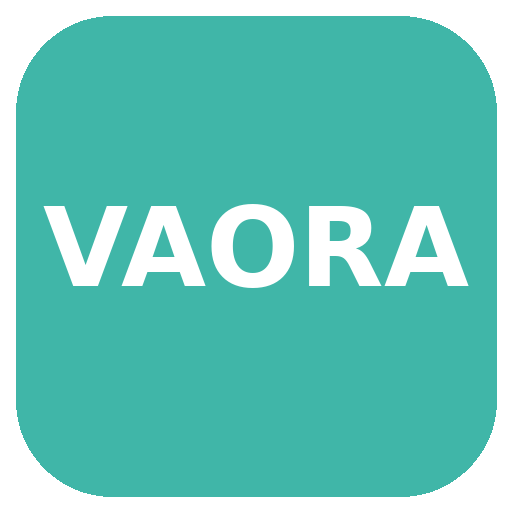
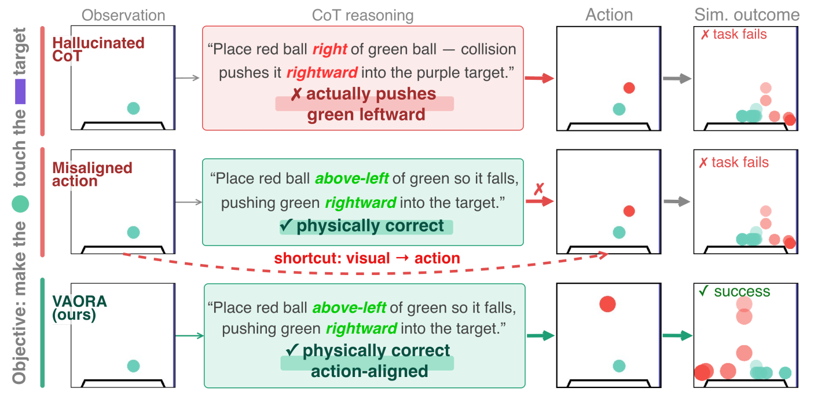
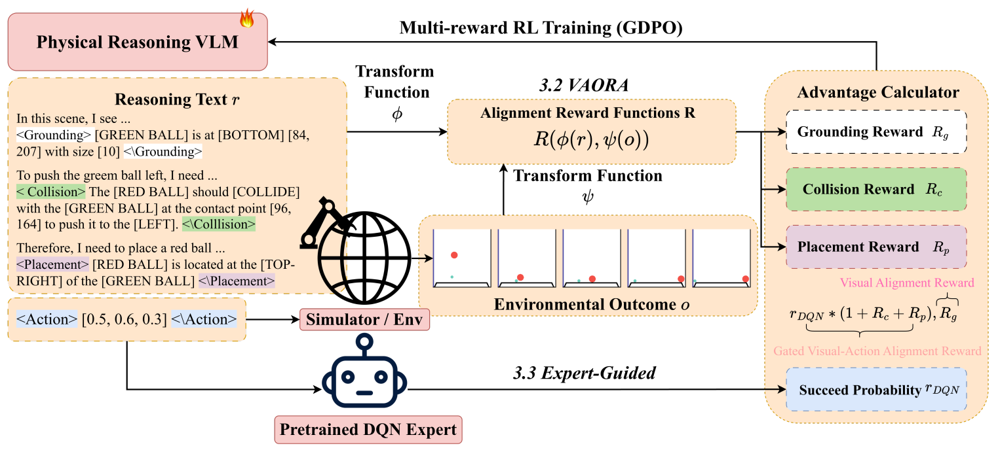

  
    
  
  

<h1 align="center">Bridging Physical Reasoning and Task Generalization via Visual Action Outcome Reasoning Alignment</h1>

  <b>VAORA</b> — <i>Visual Action Outcome Reasoning Alignment</i>

  <a href="https://vaora-proj.github.io"><b>https://vaora-proj.github.io</b></a>

Official codebase for the paper **Bridging Physical Reasoning and Task Generalization via Visual Action Outcome Reasoning Alignment**.

This repository contains four components that together implement VAORA — training vision-language models to reason about physical actions and their outcomes, and evaluating whether that reasoning transfers across tasks.

  
   
  <em><b>Two major obstacles in CoT-based physical reasoning.</b> <i>Hallucinated CoT</i> denotes physically incorrect reasoning that leads to a wrong action; <i>Misaligned Action</i> bypasses physically-aligned reasoning via a visual shortcut. VAORA resolves both.</em>

  
   
  <em><b>VAORA framework.</b> (a) <b>Visual-Alignment Reward</b> anchors reasoning to action-independent visual context (grounding reward rG). (b) <b>Gated Visual-Action Alignment Reward</b> aligns reasoning with the visual outcome of the model's action (collision rC and placement rP), gated by a DQN expert success probability.</em>

## Components

### 1. [`verl/`](verl/)

**Objective:** Reinforcement learning training for Qwen3-VL on interactive PHYRE tasks.

A customized fork of [verl](https://github.com/verl-project/verl) with VAORA-specific extensions: multi-turn PHYRE interaction, decomposed reward scoring (placement / collision / grounding), GDPO training, and a PHYRE reward server for online simulation during GRPO.

See [verl/VAORA-VERL.md](verl/VAORA-VERL.md) for training reproduction.

### 2. [`phyre/`](phyre/)

**Objective:** Physics simulation environment and DQN expert baselines.

A local build of the [PHYRE](https://github.com/facebookresearch/phyre) benchmark used as the training and evaluation world. Provides the 2D physics simulator, task splits (within-template and cross-template), and scripts to train the DQN-expert checkpoints that score action outcomes during RL.

See [phyre/README.md](phyre/README.md) for DQN experts' training reproduction.
### 3. [`Batch_Inference/`](Batch_Inference/)

**Objective:** Batch inference and dataset preparation for PHYRE and CRAFT.

Runs VLM inference at scale on PHYRE and CRAFT benchmarks using API models (ChatGPT, Claude, Gemini) or local checkpoints (Qwen3-VL, InternVL). Also hosts utilities to build training datasets and evaluation JSON from simulation outputs.

See [Batch_Inference/README.md](Batch_Inference/README.md) for data download and inference.

### 4. [`tool-games/`](tool-games/)

**Objective:** Cross-dataset generalization evaluation on Virtual-Tool.

Reproduces results on the [Virtual-Tool](https://k-r-allen.github.io/tool-games/) (tool-games) environment to test whether VAORA-trained models transfer physical reasoning to a different interactive task domain. Includes the ToolPicker simulator, VLM runners, and PHYRE DQN baselines for comparison.

See [tool-games/README.md](tool-games/README.md) for setup and evaluation.
